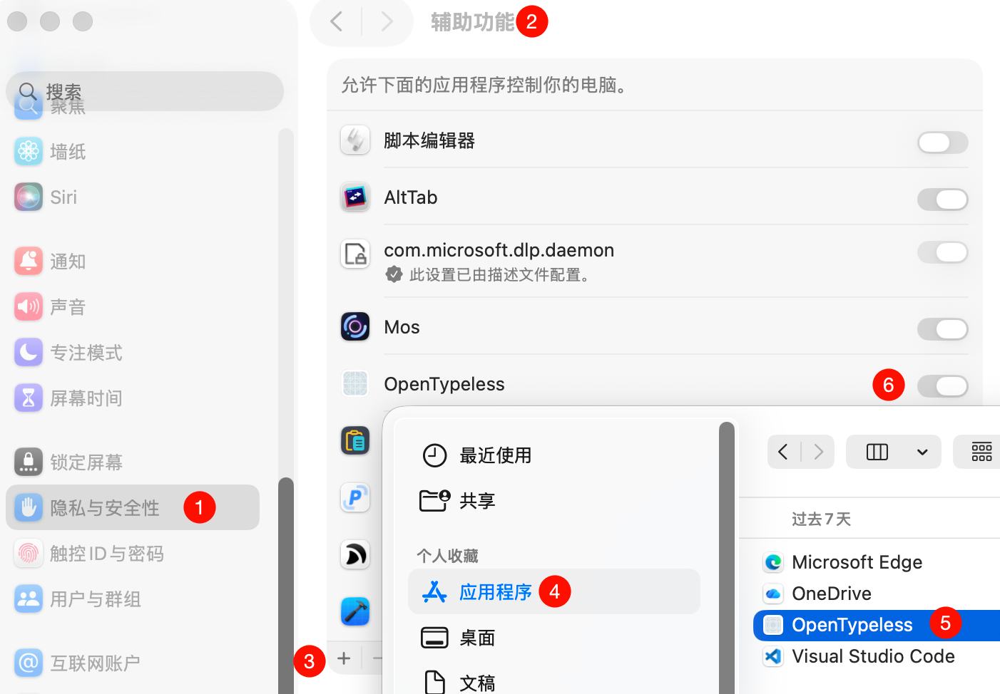

# OpenTypeless

<p align="center">
  
  
  
  
</p>

<p align="center">
  开源的 AI 驱动语音输入助手，适用于 macOS。<br>
  按住快捷键说话，释放后自动将文字插入到任意应用中。<br>
  灵感来自 <a href="https://www.typeless.com/">Typeless</a>。
</p>

<p align="center">
  <a href="README_EN.md">English</a> | 中文
</p>

---

## 功能特性

- **语音转文字** — 按住 `fn` 键说话，松开后文字自动插入光标位置
- **多语音引擎** — 支持 Apple Speech（免费离线）、Azure Speech（实时流式）、Azure OpenAI Whisper、GPT-4o Transcribe、MAI Transcribe 2（流式与非流式）
- **AI 智能润色** — 语音识别后可通过 LLM 自动修正错别字、添加标点、分条列点、去重
- **浮动面板** — 实时显示录音状态和识别结果，支持取消操作
- **历史记录** — SQLite 持久化存储，支持搜索、回放录音、对比原文与润色后文本
- **自定义快捷键** — 语音输入、免提模式、翻译模式均可自定义按键组合
- **多语言识别** — 支持中文、英语、日语、韩语、法语、德语、西班牙语、葡萄牙语等 10 种语言
- **菜单栏应用** — 常驻菜单栏，不占用 Dock 栏位
- **自定义 System Prompt** — AI 润色的提示词完全可自定义
- **可配置超时** — API 请求超时时间可自由设置
- **文件日志** — 支持 Info / Debug 两级日志，日志文件按天滚动，内置日志查看器

## 下载安装

从 [Releases](https://github.com/joeyzenghuan/OpenTypeless/releases) 下载最新的 `OpenTypeless.zip`，解压后将 `OpenTypeless.app` 拖入 `Applications` 文件夹。

> 首次打开时 macOS 可能提示"无法验证开发者"。请前往 **系统设置 → 隐私与安全性**，点击"仍要打开"。

## 系统要求

- macOS 13.0 (Ventura) 或更高版本
- 麦克风权限
- 辅助功能权限（用于文字插入）

### 开启辅助功能权限

OpenTypeless 通过模拟键盘粘贴（Cmd+V）来插入文字，需要辅助功能权限。请前往 **系统设置 → 隐私与安全性 → 辅助功能**，点击 `+` 添加 OpenTypeless 并开启开关：

<p align="center">
  
</p>

## 语音识别引擎

| 引擎 | 实时识别 | 离线 | 说明 |
|------|:------:|:----:|------|
| Apple Speech | ✅ | ✅ | 默认，免费，隐私友好，无需配置 |
| Azure Speech Service | ✅ | ❌ | 高精度、实时流式、100+ 语言，需 Azure 订阅 |
| Azure OpenAI Whisper | ❌ | ❌ | 高精度多语言，录音结束后整段转写，需部署 Whisper 模型 |
| GPT-4o Transcribe | ❌ | ❌ | 比 Whisper 更高精度，支持置信度评分和提示词引导（推荐） |
| MAI Transcribe 2 | ❌ | ❌ | 完整音频转写，支持 Verbatim/Clean 和术语提示，使用 Azure Speech Key（公共预览） |
| MAI Transcribe 2 Streaming | ✅ | ❌ | 微软实时流式转写，支持自动语言检测，需 Foundry 模型部署（公共预览） |

### MAI Transcribe 2（非流式）

在设置 → 语音中选择 **MAI Transcribe 2 (非流式，预览)**。默认使用现有 Azure Speech Key 和区域；也可关闭共用开关，填写独立 Key、区域或可选的 HTTPS 资源根地址。Key 必须对应所填区域或资源。共用模式下修改 Key 或区域也会影响 Azure Speech。

录音结束后上传 16kHz 单声道 WAV，调用 Speech Fast Transcription 的 `/speechtotext/transcriptions:transcribe?api-version=2025-10-15`，使用 `Ocp-Apim-Subscription-Key` 请求头并明确指定 `enhancedMode.enabled=true`、`enhancedMode.model=MAI-Transcribe-2`，不需要 OpenAI Deployment。只使用 `combinedPhrases` 的最终文本进入润色、粘贴和历史流程，失败或取消不会插入文本。

默认自动检测语言；指定语言会成为强提示，中英混合建议使用自动检测。可选择 **Verbatim** 保留逐字文本，或 **Clean** 清理语气词；这些是模型转写选项，与后续 AI 润色独立。术语提示每行一个。音频须短于 2 小时、小于 250 MB。服务为公共预览，无 SLA；区域可用性与限制详见[微软 MAI Transcribe 文档](https://learn.microsoft.com/azure/ai-services/speech-service/mai-transcribe)。

### MAI Transcribe 2 Streaming

在设置 → 语音中选择 **MAI Transcribe 2 Streaming (预览)**，填写 Microsoft Foundry 资源根地址（例如 `https://your-resource.services.ai.azure.com`）、实际部署名称和该资源的 API Key。默认部署名称为 `mai-transcribe-2-streaming`；如果在 Foundry 中使用了其他名称，请填写实际名称。默认自动检测语言，也可跟随全局设置或指定语言提示。中文提示发送为 `zh`。

此 Provider 使用原生 WebSocket，连接 `/mai/v1/realtime?intent=transcription`，API Key 放在请求头中，不需要升级 Azure Speech SDK。麦克风音频转换为 16kHz 单声道 PCM16，在服务确认会话配置后按顺序发送。MAI 的中间文本是可替换的后缀，而非追加片段；浮窗会显示已确定文本与最新预览的组合。

松开快捷键后，应用停止采集，排空已录音频，提交 `input_audio_buffer.commit`，等待 `completed` 中的完整最终文本，再进入现有 AI 润色、粘贴和历史保存流程。提交确认、部分结果或短暂静默都不代表转写已完成。连接错误、最终结果超时、音频发送积压或取消时，不会将不完整预览当作最终结果粘贴；缺少配置时明确报错，不会静默切换引擎。

服务当前为公共预览，无 SLA，单次会话最多 1 小时。连接和最终转写等待使用“请求超时”设置（最低 10 秒）。语言检测、可用区域和服务限制以[微软 MAI Realtime 文档](https://learn.microsoft.com/azure/ai-services/speech-service/mai-transcribe-2-streaming-realtime)为准。此接口不复用 GPT Realtime Whisper 的 Prompt 或服务端自动断句配置。

自动检测时省略 `language` 字段：实际 Azure 网关拒绝文档示例中的显式 `null`。指定语言时仍发送对应的语言代码。

### MAI 测试

- `./scripts/test-mai-transcribe.sh`：离线验证两种 Provider 的认证头、配置、PCM16 转换、multipart、响应解析、握手、预览替换、最终提交、延迟结果、超时和取消；无需 Azure Key、麦克风或剪贴板权限。
- `./scripts/test-mai-transcribe-live.sh [all|batch|streaming]`：调用真实 Azure 服务，会产生按量费用。使用 macOS Tingting/Samantha 合成中英文短音频，不上传历史录音、不访问麦克风、不粘贴文本、不改设置、不创建部署。临时音频和测试程序在结束后删除。
- 实测默认只在内存读取本机应用偏好中的凭据。可以成对设置 `AZURE_MAI_BATCH_ENDPOINT` / `AZURE_MAI_BATCH_API_KEY` 和 `AZURE_MAI_ENDPOINT` / `AZURE_MAI_API_KEY` 覆盖；流式部署通过 `AZURE_MAI_DEPLOYMENT_NAME` 指定。不要把 Key 写入仓库、命令参数或日志。
- 流式测试优先使用 MAI 设置；未配置时尝试现有 GPT Realtime Whisper / GPT-4o Transcribe 的 Foundry 资源凭据，但不会把其他转写部署当作 MAI 部署。必须先在该资源部署流式模型。

2026-10-09 的非流式四项实测与流式中英文实测均已通过；流式部署在用户授权后创建。部署配置、耗时口径和结果见[MAI 实测记录](docs/mai-transcribe-testing.md)。

### Azure 标准识别与最终精修

事件格式、两秒停顿示例、双行 UI 和最终粘贴规则详见[识别事件笔记](docs/azure-speech-recognition-events.md)。

Azure 标准模式和 Post-stream refinement 模式均通过 `Recognizing` 返回可变化的中间文本，通过 `Recognized` 返回每个语音段的最终文本。浮窗在两种模式下都上下展示：上方保留各段最后一次实时预览，下方累积最终结果；标准模式标记「Azure 标准识别」，Post 模式标记「Azure 精修」。句间停顿可能结束一个语音段，但不会结束整次录音；`SessionStopped` 才代表会话结束。标准最终结果也可能修正中间识别并添加标点，Post 则额外运行第二遍识别，替换每段的最终结果，不增加第三类精修回调。两种模式的最终文本可能相同。

Azure Speech 默认开启 **最终精修（Post-stream refinement）**，使用当前识别语言的单语言模式。说话时显示低延迟的“实时预览”，Azure 利用更完整的音频上下文做第二遍识别，通过每段的最终结果返回精修文本。浮窗分开显示两阶段内容，历史记录提供“精修对照”。短句的精修结果可能与预览一致。

松开快捷键后，应用等待最终结果和识别会话结束，立即发起粘贴；历史记录在粘贴后保存，浮窗继续展示 1.5 秒，不阻塞文本插入。开启精修时，若缺少最终结果、等待超时或服务连接异常，则保留已精修段的最终文本，未完成的段使用已有中间识别文本，浮窗和历史均标记「未完整精修」。降级内容可能不完整，请检查后使用。用户取消、配置错误或没有可用文字时不输出。成功精修后可继续 AI 润色；降级时跳过 AI 润色，立即保留文字。辅助功能权限未生效时也会写入剪贴板，并提示手动粘贴。此功能使用 Speech 服务，无需另配 Azure OpenAI。

需要受支持的区域及语言，例如 `swedencentral` + `zh-CN`。配置不受支持时会提示错误；可在语音设置关闭精修，使用标准识别。支持列表参见 [微软文档](https://learn.microsoft.com/azure/ai-services/speech-service/how-to-recognize-speech#post-stream-refinement)。本项目要求 Speech SDK **1.51.2+（1.51.x）**；升级已有工作区时运行 `pod update MicrosoftCognitiveServicesSpeech-macOS`，然后打开 `.xcworkspace`。

运行 `./scripts/test-azure-refinement.sh` 可验证延迟最终结果、音频时间偏移、多段拼接、精修失败降级、取消/配置错误时阻止输出，以及历史数据库迁移。测试使用临时数据库，不需要 Azure Key，也不修改剪贴板。Azure 回调日志记录事件原因、时间偏移、段落状态及降级原因，便于区分服务未返回最终结果与 App 合并问题。

## AI 润色引擎

| 引擎 | 说明 |
|------|------|
| Azure OpenAI | 已实现，支持 Chat Completions API 和 Responses API |
| OpenAI (GPT-4) | 设置界面已就绪，Provider 待实现 |
| Anthropic (Claude) | 设置界面已就绪，Provider 待实现 |
| 本地 LLM (Ollama) | 设置界面已就绪，Provider 待实现 |

## 快捷键

| 操作 | 默认快捷键 | 说明 |
|------|-----------|------|
| 语音输入 | 按住 `fn` | 按住说话，释放后插入文字 |
| 免提模式 | `fn` + `Space` | 按一次开始，再按一次停止 |
| 翻译模式 | `fn` + `←` | 翻译选中文本（待实现） |

所有快捷键均可在设置中自定义，支持 fn、⌘、⌥、⌃、⇧ 及其任意组合。

## 从源码构建

### 前置条件

- Xcode 15.0+
- [XcodeGen](https://github.com/yonaskolb/XcodeGen)
- [CocoaPods](https://cocoapods.org/)

### 快速开始

```bash
git clone https://github.com/joeyzenghuan/OpenTypeless.git
cd OpenTypeless

# 运行 setup 脚本（安装 XcodeGen 并生成 Xcode 项目）
./scripts/setup.sh

# 安装 CocoaPods 依赖
pod install

# 打开 Xcode 工作区
open OpenTypeless.xcworkspace
```

### 手动设置

```bash
brew install xcodegen
xcodegen generate
pod install
open OpenTypeless.xcworkspace
```

在 Xcode 中配置 **Signing & Capabilities** 后，按 `⌘R` 运行。

## 项目结构

```
OpenTypeless/
├── App/                          # 应用入口 (AppDelegate + Menu Bar)
├── Views/
│   ├── MenuBarView.swift         # 主窗口（首页、历史记录、设置侧边栏）
│   ├── SettingsView.swift        # 设置页（语音/AI/通用/快捷键/关于）
│   └── FloatingTranscriptView.swift  # 浮动面板（录音状态 + 识别结果）
├── Services/
│   ├── Speech/
│   │   ├── SpeechRecognitionProvider.swift  # 语音识别 Protocol
│   │   ├── SpeechRecognitionManager.swift   # 统一管理器
│   │   └── Providers/
│   │       ├── AppleSpeechProvider.swift     # Apple Speech Framework
│   │       ├── AzureSpeechProvider.swift     # Azure Speech SDK
│   │       ├── WhisperSpeechProvider.swift   # Azure OpenAI Whisper
│   │       └── GPT4oTranscribeSpeechProvider.swift  # GPT-4o Transcribe
│   ├── AI/
│   │   ├── AIProvider.swift                 # AI 润色 Protocol
│   │   └── Providers/
│   │       └── AzureOpenAIProvider.swift     # Azure OpenAI (Chat Completions + Responses)
│   └── Database/
│       └── HistoryDatabase.swift            # SQLite 历史记录存储
├── Models/
│   ├── AppSettings.swift          # 应用设置 (UserDefaults)
│   ├── KeyCombination.swift       # 快捷键组合模型
│   └── TranscriptionRecord.swift  # 转录记录模型 + HistoryManager
├── Utils/
│   ├── HotkeyManager.swift        # 全局快捷键监听
│   └── Logger.swift               # 文件日志系统
└── Resources/
    ├── Info.plist
    ├── OpenTypeless.entitlements
    └── Assets.xcassets/            # 应用图标（Westie 狗狗）
```

## 架构设计

项目采用 **Protocol-based 服务抽象层**，语音识别和 AI 润色均通过 Protocol 定义接口，支持运行时切换 Provider。

```
用户按住快捷键
    → HotkeyManager 检测
    → SpeechRecognitionProvider.startRecognition()
    → FloatingPanel 显示实时结果
用户松开快捷键
    → SpeechRecognitionProvider.stopRecognition()
    → AIProvider.polish() (可选)
    → 通过剪贴板 + Cmd+V 插入文字
    → HistoryDatabase 保存记录
```

## 配置说明

所有配置通过应用内设置界面管理，存储在 `UserDefaults` 中。主要配置项：

- **语音识别引擎** — 选择 STT Provider 并填写对应 API Key
- **AI 润色** — 开关、Provider 选择、Azure OpenAI 端点/Key/部署名、API 类型
- **System Prompt** — AI 润色的系统提示词，可完全自定义
- **快捷键** — 三种操作的按键组合
- **通用** — 界面语言、API 超时、日志级别

## 许可证

MIT License

## 致谢

- 灵感来自 [Typeless](https://www.typeless.com/)
- 基于 SwiftUI + Apple Speech Framework 构建
- Azure Speech SDK via [CocoaPods](https://cocoapods.org/)
