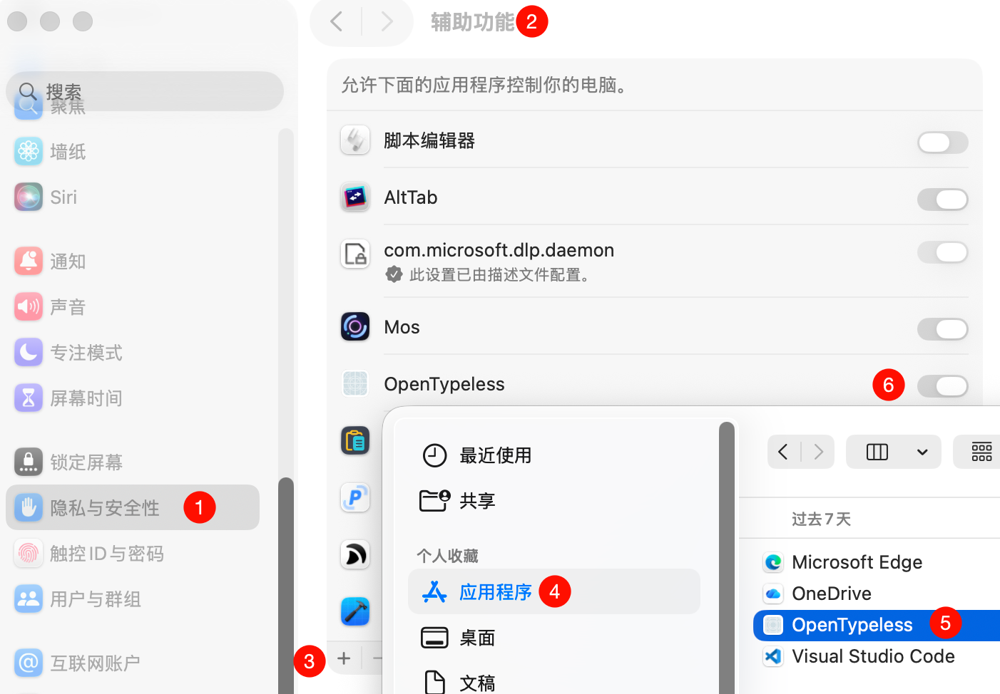

# OpenTypeless

<p align="center">
  
  
  
  
</p>

<p align="center">
  An open-source AI-powered voice input assistant for macOS.<br>
  Hold a hotkey to speak, release to insert text into any application.<br>
  Inspired by <a href="https://www.typeless.com/">Typeless</a>.
</p>

<p align="center">
  English | <a href="README.md">中文</a>
</p>

---

## Features

- **Voice to Text** — Hold `fn` to speak, release to insert text at cursor position
- **Multiple STT Engines** — Apple Speech (free, offline), Azure Speech (real-time streaming), Azure OpenAI Whisper, GPT-4o Transcribe
- **AI Polish** — Automatically fix typos, add punctuation, format lists, and remove duplicates via LLM
- **Floating Panel** — Real-time display of recording status and transcription results, with cancel support
- **History** — SQLite-backed persistent storage with search, audio playback, and original/polished text comparison
- **Custom Shortcuts** — Voice input, hands-free mode, and translate mode all support customizable key combinations
- **Multilingual** — Supports 10 languages including Chinese, English, Japanese, Korean, French, German, Spanish, and Portuguese
- **Menu Bar App** — Lives in the menu bar, doesn't clutter the Dock
- **Custom System Prompt** — Fully customizable AI polish prompt
- **Configurable Timeout** — API request timeout can be adjusted freely
- **File Logging** — Two-level logging (Info/Debug) with daily log rotation and built-in log viewer

## Installation

Download the latest `OpenTypeless.zip` from [Releases](https://github.com/joeyzenghuan/OpenTypeless/releases), unzip it and drag `OpenTypeless.app` into your `Applications` folder.

> On first launch, macOS may warn that the developer cannot be verified. Go to **System Settings → Privacy & Security** and click "Open Anyway".

## Requirements

- macOS 13.0 (Ventura) or later
- Microphone permission
- Accessibility permission (for text insertion)

### Granting Accessibility Permission

OpenTypeless inserts text by simulating keyboard paste (Cmd+V), which requires Accessibility permission. Go to **System Settings → Privacy & Security → Accessibility**, click `+` to add OpenTypeless and enable the toggle:

<p align="center">
  
</p>

## Speech Recognition Engines

| Engine | Real-time | Offline | Description |
|--------|:---------:|:-------:|-------------|
| Apple Speech | ✅ | ✅ | Default, free, privacy-friendly, no setup needed |
| Azure Speech Service | ✅ | ❌ | High accuracy, real-time streaming, 100+ languages, requires Azure subscription |
| Azure OpenAI Whisper | ❌ | ❌ | High accuracy multilingual, sends complete audio after recording, requires Whisper model deployment |
| GPT-4o Transcribe | ❌ | ❌ | Higher accuracy than Whisper, supports confidence scores and prompt guidance (recommended) |

## AI Polish Engines

| Engine | Status |
|--------|--------|
| Azure OpenAI | Implemented — supports Chat Completions API and Responses API |
| OpenAI (GPT-4) | Settings UI ready, provider not yet implemented |
| Anthropic (Claude) | Settings UI ready, provider not yet implemented |
| Local LLM (Ollama) | Settings UI ready, provider not yet implemented |

## Keyboard Shortcuts

| Action | Default Shortcut | Description |
|--------|-----------------|-------------|
| Voice Input | Hold `fn` | Hold to speak, release to insert text |
| Hands-free Mode | `fn` + `Space` | Press once to start, press again to stop |
| Translate Mode | `fn` + `←` | Translate selected text (not yet implemented) |

All shortcuts are customizable in Settings. Supports fn, ⌘, ⌥, ⌃, ⇧ and any combination.

## Building from Source

### Prerequisites

- Xcode 15.0+
- [XcodeGen](https://github.com/yonaskolb/XcodeGen)
- [CocoaPods](https://cocoapods.org/)

### Quick Start

```bash
git clone https://github.com/joeyzenghuan/OpenTypeless.git
cd OpenTypeless

# Run setup script (installs XcodeGen and generates Xcode project)
./scripts/setup.sh

# Install CocoaPods dependencies
pod install

# Open Xcode workspace
open OpenTypeless.xcworkspace
```

### Manual Setup

```bash
brew install xcodegen
xcodegen generate
pod install
open OpenTypeless.xcworkspace
```

Configure **Signing & Capabilities** in Xcode, then press `⌘R` to run.

## Project Structure

```
OpenTypeless/
├── App/                          # App entry point (AppDelegate + Menu Bar)
├── Views/
│   ├── MenuBarView.swift         # Main window (Home, History, Settings sidebar)
│   ├── SettingsView.swift        # Settings (Speech/AI/General/Shortcuts/About)
│   └── FloatingTranscriptView.swift  # Floating panel (recording status + results)
├── Services/
│   ├── Speech/
│   │   ├── SpeechRecognitionProvider.swift  # Speech recognition Protocol
│   │   ├── SpeechRecognitionManager.swift   # Unified manager
│   │   └── Providers/
│   │       ├── AppleSpeechProvider.swift     # Apple Speech Framework
│   │       ├── AzureSpeechProvider.swift     # Azure Speech SDK
│   │       ├── WhisperSpeechProvider.swift   # Azure OpenAI Whisper
│   │       └── GPT4oTranscribeSpeechProvider.swift  # GPT-4o Transcribe
│   ├── AI/
│   │   ├── AIProvider.swift                 # AI polish Protocol
│   │   └── Providers/
│   │       └── AzureOpenAIProvider.swift     # Azure OpenAI (Chat Completions + Responses)
│   └── Database/
│       └── HistoryDatabase.swift            # SQLite history storage
├── Models/
│   ├── AppSettings.swift          # App settings (UserDefaults)
│   ├── KeyCombination.swift       # Keyboard shortcut combination model
│   └── TranscriptionRecord.swift  # Transcription record model + HistoryManager
├── Utils/
│   ├── HotkeyManager.swift        # Global hotkey listener
│   └── Logger.swift               # File logging system
└── Resources/
    ├── Info.plist
    ├── OpenTypeless.entitlements
    └── Assets.xcassets/            # App icon (Westie dog)
```

## Architecture

The project uses a **Protocol-based service abstraction layer**. Both speech recognition and AI polish are defined through Protocols, supporting runtime Provider switching.

```
User holds hotkey
    → HotkeyManager detects
    → SpeechRecognitionProvider.startRecognition()
    → FloatingPanel shows real-time results
User releases hotkey
    → SpeechRecognitionProvider.stopRecognition()
    → AIProvider.polish() (optional)
    → Insert text via clipboard + Cmd+V
    → HistoryDatabase saves record
```

## Configuration

All configuration is managed through the in-app Settings interface, stored in `UserDefaults`:

- **Speech Engine** — Select STT Provider and enter the corresponding API Key
- **AI Polish** — Toggle, provider selection, Azure OpenAI endpoint/key/deployment, API type
- **System Prompt** — Fully customizable AI polish system prompt
- **Shortcuts** — Key combinations for three actions
- **General** — Interface language, API timeout, log level

## License

MIT License

## Acknowledgments

- Inspired by [Typeless](https://www.typeless.com/)
- Built with SwiftUI and Apple Speech Framework
- Azure Speech SDK via [CocoaPods](https://cocoapods.org/)
